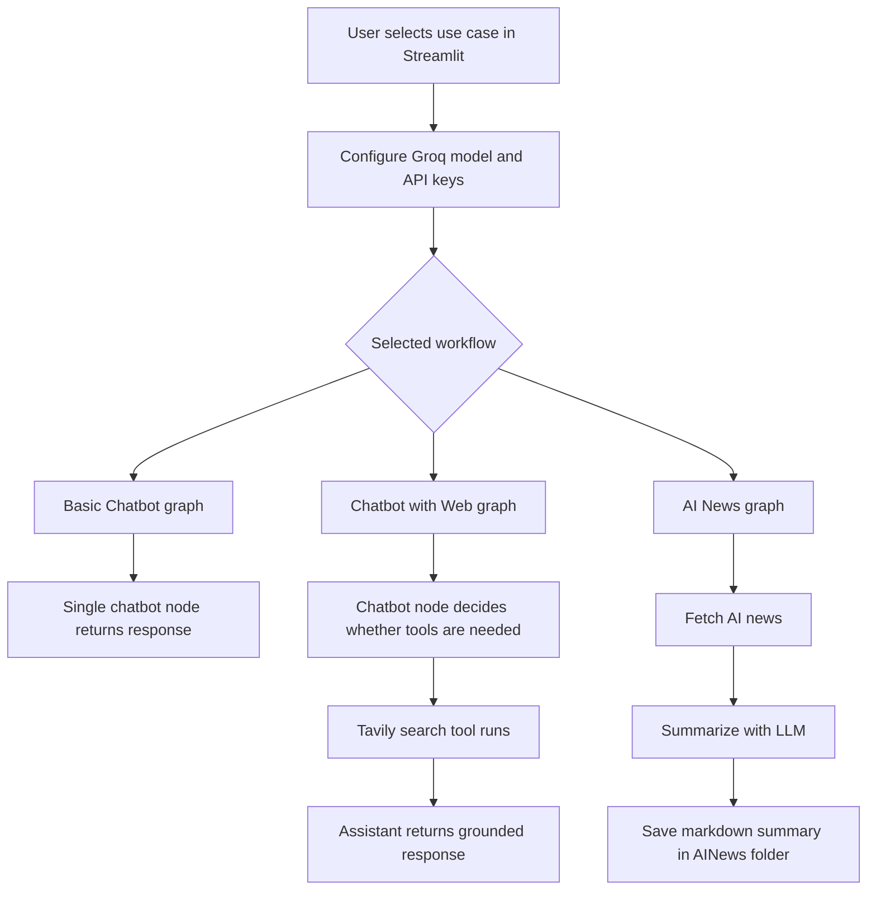
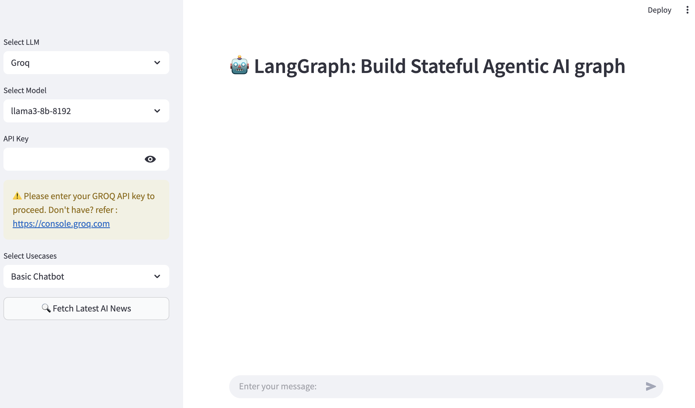
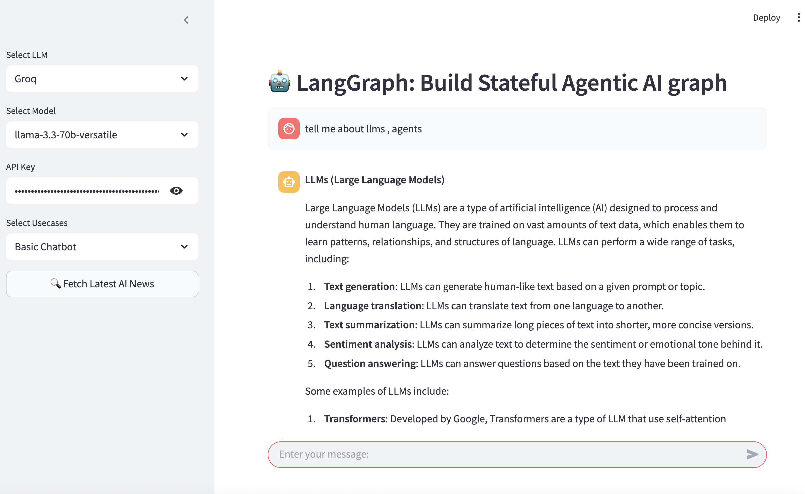
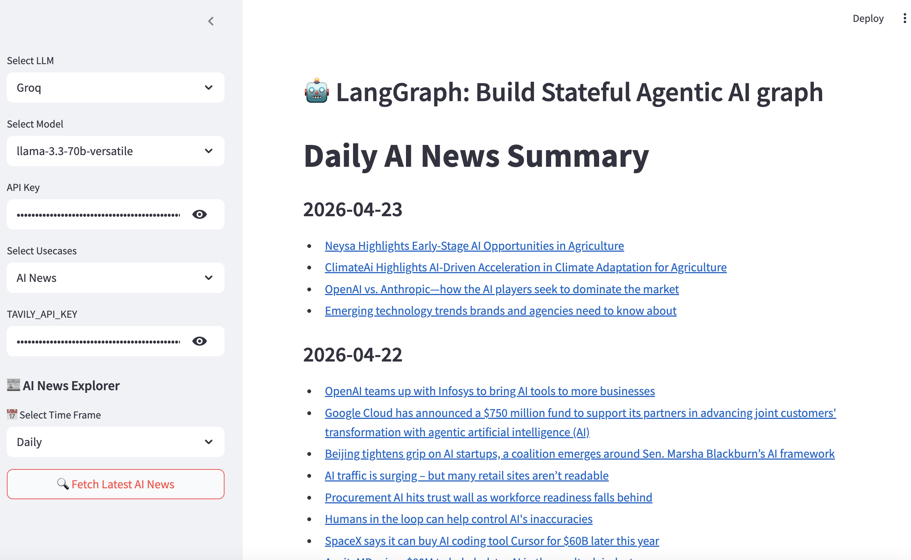

# Agentic Chatbot with LangGraph

An end-to-end Streamlit project that uses LangGraph to build a stateful agentic chatbot with multiple use cases: a basic chatbot, a web-enabled chatbot with Tavily search tools, and an AI news summarizer.

## Live Repo

- GitHub: [Agentic_Chatbot](https://github.com/sharmanitin20/Agentic_Chatbot)

## Project Overview

This project demonstrates how to build a stateful AI workflow with LangGraph instead of a single prompt-response loop.

The app lets users:

- choose the LLM provider and model from the sidebar
- enter a `GROQ_API_KEY` to run Groq-powered chat
- switch between multiple LangGraph-driven use cases
- use Tavily search when web access is needed
- generate AI news summaries by time frame
- interact through a simple Streamlit chat interface

## Use Cases

### 1. Basic Chatbot

A simple LangGraph flow with a single chatbot node. This mode is useful for standard question answering and conversational interaction.

### 2. Chatbot with Web

A tool-augmented chatbot that uses Tavily search through LangGraph tool nodes. This mode allows the assistant to call search tools when answering web-related questions.

### 3. AI News

A small agentic workflow that:

1. fetches recent AI news with Tavily
2. summarizes the news with the selected Groq model
3. saves the result as Markdown inside the `AINews/` folder

## Tech Stack

- Python
- Streamlit
- LangGraph
- LangChain
- Groq
- Tavily Search
- FAISS

## How It Works



## App Workflow

1. Select `Groq` as the LLM.
2. Choose a Groq model from the sidebar.
3. Enter your `GROQ_API_KEY`.
4. Pick one of the supported use cases.
5. If using `Chatbot with Web` or `AI News`, also enter `TAVILY_API_KEY`.
6. Chat in the main input box or fetch the latest AI news from the sidebar.

## Screenshots

### 1. Main app interface

The app opens with a sidebar for model and use-case selection, plus the main chat area for interacting with the LangGraph workflow.



### 2. Basic chatbot response

In `Basic Chatbot` mode, the assistant answers directly using the selected Groq model through a simple LangGraph state flow.



### 3. AI news summary mode

In `AI News` mode, the app fetches recent AI headlines, summarizes them, and renders the result in Markdown inside the main panel.



## Project Structure

```text
AgenticChatbot/
├── app.py
├── README.md
├── requirements.txt
├── AINews/
│   ├── daily_summary.md
│   └── weekly_summary.md
├── assets/
│   └── screenshots/
└── src/
    └── langgraphagenticai/
        ├── main.py
        ├── LLMS/
        │   └── groqllm.py
        ├── graph/
        │   └── graph_builder.py
        ├── nodes/
        │   ├── ai_news_node.py
        │   ├── basic_chatbot_node.py
        │   └── chatbot_with_tool_node.py
        ├── state/
        │   └── state.py
        ├── tools/
        │   └── search_tool.py
        └── ui/streamlitui/
            ├── display_result.py
            ├── loadui.py
            ├── uiconfig.ini
            └── uiconfig.py
```

## Installation

Install dependencies:

```bash
pip install -r requirements.txt
```

## Environment Variables

You can provide keys in the app sidebar, but you may also export them locally:

```bash
export GROQ_API_KEY=your_groq_api_key
export TAVILY_API_KEY=your_tavily_api_key
```

## Run Locally

```bash
streamlit run app.py
```

Open:

```text
http://localhost:8501
```

## Output Files

The AI news workflow writes generated summaries to:

- `AINews/daily_summary.md`
- `AINews/weekly_summary.md`
- `AINews/monthly_summary.md` when monthly mode is used

## What This Project Demonstrates

- stateful workflow design with LangGraph
- multi-use-case AI app architecture
- Groq model integration in a Streamlit UI
- tool calling with Tavily search
- automated AI news summarization and Markdown output

## GitHub Description

`A LangGraph-based agentic chatbot built with Streamlit, Groq, and Tavily, featuring basic chat, web-enabled chat, and AI news summarization workflows.`
